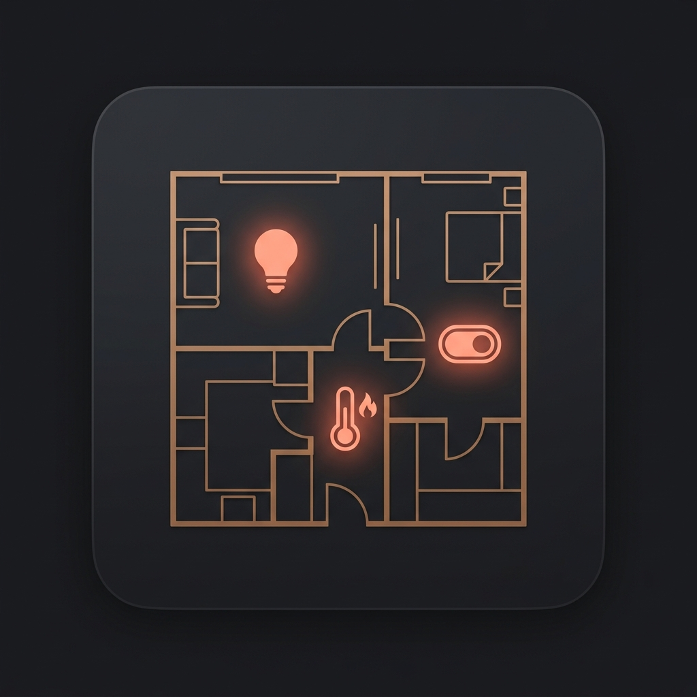

# Custom Room Card

<p align="center">
  
</p>

<p align="center">
  <a href="https://my.home-assistant.io/redirect/hacs_repository/?owner=portbusy&repository=custom-room-card&category=plugin"></a>
</p>

A premium, highly-configurable, and theme-consistent Lovelace multi-room card for Home Assistant. Configure your rooms, headers, quick control chips, visibility conditions, and custom tap/hold actions directly from the Home Assistant visual editor or via YAML.

No external dependencies (such as `button-card`, `mushroom`, `card-mod`, or `stack-in-card`) are required.

---

## Key Features

* ⚡ **Native Visual Editor**: Configure everything visually! Pick areas, select entities, choose custom colors, order categories, and edit visibility conditions without typing a single line of YAML.
* 🎨 **100% Theme-Consistent**: Completely styled using native Home Assistant CSS custom properties (`--ha-card-background`, `--secondary-background-color`, `--ha-card-border-radius`, `--ha-card-border-color`). Automatically blends into light, dark, warm, or custom dashboards.
* 🌐 **Multi-Language Support**: Automatically localizes its user interface, greetings, and labels based on your Home Assistant profile language. Out-of-the-box support for **English (`en`)**, **Italian (`it`)**, **French (`fr`)**, **Spanish (`es`)**, and **German (`de`)**.
* 🌡️ **Rich Header Info**: Shows presence status (motion icon), door/window status (opening icon), temperature, humidity, and illuminance (lux) dynamically in the room title.
* 🏃 **Motion Sorting**: Automatically prioritizes active rooms by moving those with detected motion to the top of the dashboard.
* ⏱️ **Presence Activity Tracking**: Displays relative time since motion was last detected (e.g., "now", "10m ago", "2h ago") next to the room title.
* 🎛️ **Quick Controls (Chips)**: Configurable action chips grouped by categories (Lights, Covers, Climate, Media, Switches) for immediate control. Tapping a light or switch toggles it immediately, while tapping other categories opens their respective details dialog.
* 👁️ **Conditional Visibility**: Leverage the native, nested Home Assistant visibility editor (`ha-card-conditions-editor`) to dynamically hide or show rooms and individual chips based on user state, numeric values, entity states, location, or screen size.
* 📝 **Template Support**: Customize entity names and labels dynamically using Home Assistant jinja template values (e.g. `{{ states('sensor.custom_label') }}`).
* 🌦️ **Weather Header Mode**: Optionally configure a beautiful, cohesive animated weather banner to act as the main header for your room cards dashboard.

---

## Installation

### Installation via HACS (Recommended)

1. Open HACS in your Home Assistant instance.
2. Go to **Frontend**, click the three dots in the top-right corner, and select **Custom repositories**.
3. Paste the URL of this repository: `https://github.com/portbusy/custom-room-card`
4. Set the Category to **Dashboard** (or **Lovelace**) and click **Add**.
5. Find **Custom Room Card** in HACS, click **Download**, and select the latest version.
6. Refresh your browser (or restart Home Assistant if prompted).

### Manual Installation

1. Download the compiled `custom-room-card.js` file from the [latest release](https://github.com/portbusy/custom-room-card/releases).
2. Copy the file into your Home Assistant config directory under `www/` (e.g., `www/custom-room-card.js`).
3. Add the resource reference in your Lovelace dashboard configuration:
   * **Visual UI**: Go to Settings -> Dashboards -> Resources (three dots in top-right) -> Add Resource.
     * URL: `/local/custom-room-card.js`
     * Type: `JavaScript Module`
   * **YAML Configuration**:
     ```yaml
     lovelace:
       resources:
         - url: /local/custom-room-card.js
           type: module
     ```

---

## Configuration

The visual editor handles all configurations natively. However, you can also define your dashboard using YAML:

### Rooms Mode Configuration Example

```yaml
type: custom:custom-room-card
card_type: rooms
sort_by_motion: true
show_entity_icons: false
category_order:
  - lights
  - climate
  - covers
  - media
  - switches
rooms:
  - area: living_room
    title: Living Room
    color: "#a66d58"
    icon: mdi:sofa
    motion_entity: binary_sensor.living_room_presence
    opening_entity: binary_sensor.living_room_window
    temperature_entity: sensor.living_room_temperature
    humidity_entity: sensor.living_room_humidity
    illuminance_entity: sensor.living_room_lux
    summary_entities:
      - entity: sensor.air_quality_co2
        name: CO₂
        icon: mdi:molecule-co2
    entities:
      lights:
        - entity: light.living_room_lights
          name: Main Lights
      covers:
        - entity: cover.living_room_shutter
      climate:
        - entity: climate.living_room_ac
    tap_action:
      action: more-info
    hold_action:
      action: navigate
      navigation_path: /lovelace/living-room-details
```

### Weather Header Mode Configuration Example

```yaml
type: custom:custom-room-card
card_type: weather
temp_entity: sensor.outside_temperature
condition_entity: weather.home
high_temp_entity: sensor.today_max_temp
low_temp_entity: sensor.today_min_temp
precip_probability_entity: sensor.today_rain_probability
weather_icon_entity: sensor.weather_condition_icon
sunset_entity: sun.sun
color: "#1a365d"
chips:
  - entity: sensor.outside_humidity
    icon: mdi:water-percent
  - entity: sensor.outside_wind_speed
    icon: mdi:wind
```

---

## Card Parameters

| Parameter | Type | Required | Description |
| :--- | :--- | :--- | :--- |
| `type` | string | **Yes** | Must be `custom:custom-room-card`. |
| `card_type` | string | No | Mode of the card: `rooms` (default) or `weather`. |
| `sort_by_motion` | boolean | No | Automatically moves rooms with active motion/occupancy to the top (only in `rooms` mode). Default: `false`. |
| `show_entity_icons` | boolean | No | Ignores category default icons and forces chips to display real entity icons if configured in Home Assistant. Default: `false`. |
| `category_order` | list | No | Custom display order of category chips. List of: `lights`, `covers`, `climate`, `media`, `switches`. |
| `rooms` | list | No | List of room configuration objects (see below) (only when `card_type: rooms`). |

### Room Objects Parameters

| Parameter | Type | Required | Description |
| :--- | :--- | :--- | :--- |
| `area` | string | **Yes** | The exact ID or name of the Home Assistant Area. |
| `title` | string | No | Custom display title for the room (defaults to Area name). |
| `icon` | string | No | Custom header icon (defaults to Area icon or `mdi:home`). |
| `color` | string | No | Custom color for header and active indicators (defaults to color themed on the area name). |
| `motion_entity` | string | No | Binary sensor ID used to track occupancy/motion (turns the header color active and tracks last changed time). |
| `opening_entity` | string | No | Binary sensor ID used to display door/window open/closed states. |
| `temperature_entity` | string | No | Sensor ID for room temperature. |
| `humidity_entity` | string | No | Sensor ID for room humidity. |
| `illuminance_entity` | string | No | Sensor ID for room lux levels. |
| `summary_entities` | list | No | Additional sensors list to display in the header summary with name/icon customizations. |
| `entities` | object | No | Key-value list of quick control chips divided by category (`lights`, `covers`, `climate`, `media`, `switches`). |
| `visibility` | list/object | No | Nested native Lovelace conditional rules for hiding/showing this room card. |
| `tap_action` | object | No | Custom tap action config for the room header (follows HA action format). Default: `more-info`. |
| `hold_action` | object | No | Custom long-press action config for the room header. Default: `none`. |

---

## Local Development

If you want to contribute or build your own customized version:

1. Clone this repository locally.
2. Install dependencies:
   ```sh
   npm install
   ```
3. Run the development builder:
   ```sh
   npm run build
   ```
4. Check syntax validation:
   ```sh
   npm run check
   ```

The compiled bundle will be saved to `custom-room-card.js` which is directly loadable as a frontend module.

---

## License

This project is licensed under the MIT License.
